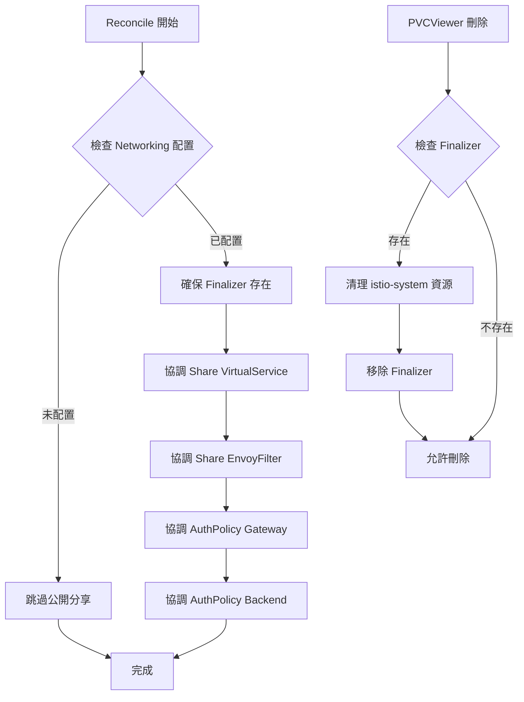

# PVCViewer 公開分享功能設計文檔

## 概述

為 PVCViewer 添加公開分享功能，允許使用者將 `/share/` 路徑下的內容公開存取，無需身份驗證。此功能**預設啟用且不可關閉**，避免修改上層應用程式。

## 需求分析

### 核心需求
- 當 [`Networking`](api/v1alpha1/pvcviewer_types.go:50-66) 配置存在時，自動啟用公開分享功能
- 允許 `/pvcviewers/{namespace}/{name}/share/*` 路徑的公開存取
- 繞過 Kubeflow 的身份驗證機制
- 只允許特定的 HTTP 方法（GET、HEAD、OPTIONS）
- `/share/` 路徑的權限由 PVCViewer 應用程式（FileBrowser）自行管理
- **無需修改 CRD**，不添加新欄位

### 參考範本
根據 [`shared_pvcviewer.yaml`](shared_pvcviewer.yaml) 範本，需要創建以下資源：

1. **VirtualService** - 公開路由規則（針對 `/share/` 路徑）
2. **EnvoyFilter** - 繞過 ext_authz 認證過濾器
3. **AuthorizationPolicy (Gateway)** - Gateway 層級的 ALLOW 規則
4. **AuthorizationPolicy (Backend)** - 後端 Pod 的 ALLOW 規則

## 架構設計

### 1. CRD 修改

**無需修改 CRD！** 公開分享功能將在 [`Networking`](api/v1alpha1/pvcviewer_types.go:40) 配置存在時自動啟用。

這樣的設計優勢：
- ✅ 不需要修改上層應用（Volumes Web App）
- ✅ 向後相容，現有的 PVCViewer 自動獲得公開分享功能
- ✅ 簡化配置，減少使用者困惑

### 2. Controller 擴展

#### 2.1 主要 Reconcile 流程

在 [`Reconcile()`](controllers/pvcviewer_controller.go:96-146) 方法中添加新的協調步驟：

```go
func (r *PVCViewerReconciler) Reconcile(ctx context.Context, req ctrl.Request) (ctrl.Result, error) {
    log := log.FromContext(ctx)
    
    instance := &kubefloworgv1alpha1.PVCViewer{}
    if err := r.Get(ctx, req.NamespacedName, instance); err != nil {
        return reconcile.Result{}, client.IgnoreNotFound(err)
    }
    
    if !instance.ObjectMeta.DeletionTimestamp.IsZero() {
        log.Info("PVCViewer is being deleted")
        if err := r.reconcileStatus(ctx, log, instance.Name, instance.Namespace); err != nil {
            log.Error(err, "Error while reconciling status")
            return ctrl.Result{}, err
        }
        return reconcile.Result{}, nil
    }
    
    commonLabels := map[string]string{
        nameLabelKey:     instance.Name,
        instanceLabelKey: resourcePrefix + instance.Name,
        partOfLabelKey:   partOfLabelValue,
    }
    
    if err := r.reconcileDeployment(ctx, log, instance, commonLabels); err != nil {
        log.Error(err, "Error while reconciling deployment")
        return ctrl.Result{}, err
    }
    
    if err := r.reconcileService(ctx, log, instance, commonLabels); err != nil {
        log.Error(err, "Error while reconciling service")
        return ctrl.Result{}, err
    }
    
    if err := r.reconcileVirtualService(ctx, log, instance, commonLabels); err != nil {
        log.Error(err, "Error while reconciling virtual service")
        return ctrl.Result{}, err
    }
    
    // 新增：協調公開分享資源（當 Networking 配置存在時）
    if err := r.reconcilePublicShareResources(ctx, log, instance, commonLabels); err != nil {
        log.Error(err, "Error while reconciling public share resources")
        return ctrl.Result{}, err
    }
    
    if err := r.reconcileStatus(ctx, log, instance.Name, instance.Namespace); err != nil {
        log.Error(err, "Error while reconciling status")
        return ctrl.Result{}, err
    }
    
    return ctrl.Result{}, nil
}
```

#### 2.2 新增協調方法

##### reconcilePublicShareResources()

```go
func (r *PVCViewerReconciler) reconcilePublicShareResources(
    ctx context.Context,
    log logr.Logger,
    viewer *kubefloworgv1alpha1.PVCViewer,
    commonLabels map[string]string,
) error {
    // 只有當 Networking 已配置時才創建公開分享資源
    if viewer.Spec.Networking == (kubefloworgv1alpha1.Networking{}) {
        log.Info("Skipping public share resources: Networking not configured")
        return nil
    }
    
    // 協調各個資源
    if err := r.reconcileShareVirtualService(ctx, log, viewer, commonLabels); err != nil {
        return fmt.Errorf("failed to reconcile share VirtualService: %w", err)
    }
    
    if err := r.reconcileShareEnvoyFilter(ctx, log, viewer); err != nil {
        return fmt.Errorf("failed to reconcile share EnvoyFilter: %w", err)
    }
    
    if err := r.reconcileShareAuthPolicyGateway(ctx, log, viewer); err != nil {
        return fmt.Errorf("failed to reconcile share AuthorizationPolicy (Gateway): %w", err)
    }
    
    if err := r.reconcileShareAuthPolicyBackend(ctx, log, viewer, commonLabels); err != nil {
        return fmt.Errorf("failed to reconcile share AuthorizationPolicy (Backend): %w", err)
    }
    
    return nil
}
```

##### reconcileShareVirtualService()

創建額外的 VirtualService 路由規則用於 `/share/` 路徑：

```go
func (r *PVCViewerReconciler) reconcileShareVirtualService(
    ctx context.Context,
    log logr.Logger,
    viewer *kubefloworgv1alpha1.PVCViewer,
    commonLabels map[string]string,
) error {
    vsName := fmt.Sprintf("pvcviewer-share-%s", viewer.Name)
    routeName := fmt.Sprintf("pvcviewer-%s-%s-share-public", viewer.Namespace, viewer.Name)
    sharePath := fmt.Sprintf("%s/%s/%s/share/",
        viewer.Spec.Networking.BasePrefix,
        viewer.Namespace,
        viewer.Name)
    
    // 獲取 Istio Gateway
    istioGateway := os.Getenv(istioGatewayEnvKey)
    if istioGateway == "" {
        istioGateway = defaultIstioGateway
    }
    
    vs := &unstructured.Unstructured{
        Object: map[string]interface{}{
            "apiVersion": "networking.istio.io/v1beta1",
            "kind":       "VirtualService",
            "metadata": map[string]interface{}{
                "name":      vsName,
                "namespace": viewer.Namespace,
                "labels":    commonLabels,
            },
            "spec": map[string]interface{}{
                "hosts":    []string{"*"},
                "gateways": []string{istioGateway},
                "http": []interface{}{
                    map[string]interface{}{
                        "name": routeName,
                        "match": []interface{}{
                            map[string]interface{}{
                                "uri": map[string]interface{}{
                                    "prefix": sharePath,
                                },
                            },
                        },
                        "route": []interface{}{
                            map[string]interface{}{
                                "destination": map[string]interface{}{
                                    "host": fmt.Sprintf("%s%s.%s.svc.cluster.local",
                                        resourcePrefix, viewer.Name, viewer.Namespace),
                                    "port": map[string]interface{}{
                                        "number": int64(servicePort),
                                    },
                                },
                            },
                        },
                    },
                },
            },
        },
    }
    
    if err := ctrl.SetControllerReference(viewer, vs, r.Scheme); err != nil {
        return err
    }
    
    return r.createOrUpdateUnstructured(ctx, log, vs, "Share VirtualService")
}
```

##### reconcileShareEnvoyFilter()

創建 EnvoyFilter 繞過認證：

```go
func (r *PVCViewerReconciler) reconcileShareEnvoyFilter(
    ctx context.Context,
    log logr.Logger,
    viewer *kubefloworgv1alpha1.PVCViewer,
) error {
    efName := fmt.Sprintf("bypass-auth-pvcviewer-share-%s-%s",
        viewer.Namespace, viewer.Name)
    routeName := fmt.Sprintf("pvcviewer-%s-%s-share-public",
        viewer.Namespace, viewer.Name)
    
    ef := &unstructured.Unstructured{
        Object: map[string]interface{}{
            "apiVersion": "networking.istio.io/v1alpha3",
            "kind":       "EnvoyFilter",
            "metadata": map[string]interface{}{
                "name":      efName,
                "namespace": "istio-system",
                "labels": map[string]string{
                    "pvcviewer.kubeflow.org/name":      viewer.Name,
                    "pvcviewer.kubeflow.org/namespace": viewer.Namespace,
                },
            },
            "spec": map[string]interface{}{
                "workloadSelector": map[string]interface{}{
                    "labels": map[string]interface{}{
                        "istio": "ingressgateway",
                    },
                },
                "configPatches": []interface{}{
                    // HTTP port 8080
                    createEnvoyFilterPatch(routeName, "*:8080"),
                    // HTTPS port 443
                    createEnvoyFilterPatch(routeName, "*:443"),
                },
            },
        },
    }
    
    // 注意：EnvoyFilter 在 istio-system namespace，不能設置跨 namespace 的 OwnerReference
    // 使用標籤來追蹤資源歸屬
    
    return r.createOrUpdateUnstructured(ctx, log, ef, "Share EnvoyFilter")
}

func createEnvoyFilterPatch(routeName, vhostName string) map[string]interface{} {
    return map[string]interface{}{
        "applyTo": "HTTP_ROUTE",
        "match": map[string]interface{}{
            "context": "GATEWAY",
            "routeConfiguration": map[string]interface{}{
                "vhost": map[string]interface{}{
                    "name": vhostName,
                    "route": map[string]interface{}{
                        "name": routeName,
                    },
                },
            },
        },
        "patch": map[string]interface{}{
            "operation": "MERGE",
            "value": map[string]interface{}{
                "typed_per_filter_config": map[string]interface{}{
                    "envoy.filters.http.ext_authz": map[string]interface{}{
                        "@type":    "type.googleapis.com/envoy.extensions.filters.http.ext_authz.v3.ExtAuthzPerRoute",
                        "disabled": true,
                    },
                },
            },
        },
    }
}
```

##### reconcileShareAuthPolicyGateway()

創建 Gateway 層級的 AuthorizationPolicy：

```go
func (r *PVCViewerReconciler) reconcileShareAuthPolicyGateway(
    ctx context.Context,
    log logr.Logger,
    viewer *kubefloworgv1alpha1.PVCViewer,
) error {
    apName := fmt.Sprintf("allow-pvcviewer-share-%s-%s-gw",
        viewer.Namespace, viewer.Name)
    sharePath := fmt.Sprintf("%s/%s/%s/share/*",
        viewer.Spec.Networking.BasePrefix,
        viewer.Namespace,
        viewer.Name)
    
    ap := &unstructured.Unstructured{
        Object: map[string]interface{}{
            "apiVersion": "security.istio.io/v1",
            "kind":       "AuthorizationPolicy",
            "metadata": map[string]interface{}{
                "name":      apName,
                "namespace": "istio-system",
                "labels": map[string]string{
                    "pvcviewer.kubeflow.org/name":      viewer.Name,
                    "pvcviewer.kubeflow.org/namespace": viewer.Namespace,
                },
            },
            "spec": map[string]interface{}{
                "selector": map[string]interface{}{
                    "matchLabels": map[string]interface{}{
                        "istio": "ingressgateway",
                    },
                },
                "action": "ALLOW",
                "rules": []interface{}{
                    map[string]interface{}{
                        "to": []interface{}{
                            map[string]interface{}{
                                "operation": map[string]interface{}{
                                    "paths": []string{sharePath},
                                },
                            },
                        },
                    },
                },
            },
        },
    }
    
    return r.createOrUpdateUnstructured(ctx, log, ap, "Share AuthorizationPolicy (Gateway)")
}
```

##### reconcileShareAuthPolicyBackend()

創建後端 Pod 的 AuthorizationPolicy：

```go
func (r *PVCViewerReconciler) reconcileShareAuthPolicyBackend(
    ctx context.Context,
    log logr.Logger,
    viewer *kubefloworgv1alpha1.PVCViewer,
    commonLabels map[string]string,
) error {
    apName := fmt.Sprintf("allow-pvcviewer-share-%s-inbound", viewer.Name)
    
    // 固定允許的 HTTP 方法（只讀操作）
    methods := []string{"GET", "HEAD", "OPTIONS"}
    
    // 路徑配置：需要同時匹配外部路徑和內部路徑
    externalPath := fmt.Sprintf("%s/%s/%s/share/*",
        viewer.Spec.Networking.BasePrefix,
        viewer.Namespace,
        viewer.Name)
    internalPath := "/share/*"
    
    ap := &unstructured.Unstructured{
        Object: map[string]interface{}{
            "apiVersion": "security.istio.io/v1",
            "kind":       "AuthorizationPolicy",
            "metadata": map[string]interface{}{
                "name":      apName,
                "namespace": viewer.Namespace,
                "labels":    commonLabels,
            },
            "spec": map[string]interface{}{
                "selector": map[string]interface{}{
                    "matchLabels": map[string]interface{}{
                        instanceLabelKey: resourcePrefix + viewer.Name,
                    },
                },
                "action": "ALLOW",
                "rules": []interface{}{
                    map[string]interface{}{
                        "to": []interface{}{
                            map[string]interface{}{
                                "operation": map[string]interface{}{
                                    "methods": methods,
                                    "paths":   []string{externalPath, internalPath},
                                },
                            },
                        },
                    },
                },
            },
        },
    }
    
    if err := ctrl.SetControllerReference(viewer, ap, r.Scheme); err != nil {
        return err
    }
    
    return r.createOrUpdateUnstructured(ctx, log, ap, "Share AuthorizationPolicy (Backend)")
}
```

##### createOrUpdateUnstructured() 輔助方法

```go
func (r *PVCViewerReconciler) createOrUpdateUnstructured(
    ctx context.Context,
    log logr.Logger,
    obj *unstructured.Unstructured,
    resourceType string,
) error {
    existing := &unstructured.Unstructured{}
    existing.SetGroupVersionKind(obj.GroupVersionKind())
    
    err := r.Get(ctx, types.NamespacedName{
        Name:      obj.GetName(),
        Namespace: obj.GetNamespace(),
    }, existing)
    
    if err != nil {
        if apierrs.IsNotFound(err) {
            log.Info(fmt.Sprintf("Creating %s", resourceType),
                "name", obj.GetName(),
                "namespace", obj.GetNamespace())
            return r.Create(ctx, obj)
        }
        return err
    }
    
    // 更新資源
    obj.SetResourceVersion(existing.GetResourceVersion())
    log.Info(fmt.Sprintf("Updating %s", resourceType),
        "name", obj.GetName(),
        "namespace", obj.GetNamespace())
    return r.Update(ctx, obj)
}
```

### 3. SetupWithManager 更新

需要監視新的資源類型：

```go
func (r *PVCViewerReconciler) SetupWithManager(mgr ctrl.Manager) error {
    // 創建 EnvoyFilter 和 AuthorizationPolicy 的模板
    envoyFilterTemplate := &unstructured.Unstructured{
        Object: map[string]interface{}{
            "apiVersion": "networking.istio.io/v1alpha3",
            "kind":       "EnvoyFilter",
        },
    }
    
    authPolicyTemplate := &unstructured.Unstructured{
        Object: map[string]interface{}{
            "apiVersion": "security.istio.io/v1",
            "kind":       "AuthorizationPolicy",
        },
    }
    
    return ctrl.NewControllerManagedBy(mgr).
        For(&kubefloworgv1alpha1.PVCViewer{}).
        // 現有資源
        Owns(&appsv1.Deployment{}).
        Owns(&corev1.Service{}).
        Owns(virtualServiceTemplate).
        // 新增：公開分享資源
        Owns(envoyFilterTemplate).   // 注意：istio-system 中的資源無法使用 Owns
        Owns(authPolicyTemplate).    // 注意：istio-system 中的資源無法使用 Owns
        Complete(r)
}
```

**重要注意事項**：
- istio-system namespace 中的資源（EnvoyFilter 和 Gateway AuthorizationPolicy）無法使用 `Owns()` 建立 OwnerReference
- 這些資源需要通過標籤追蹤，並在 PVCViewer 刪除時手動清理
- 可能需要使用 Finalizer 確保清理

### 4. Finalizer 處理（確保 istio-system 資源清理）

```go
const publicShareFinalizer = "pvcviewer.kubeflow.org/public-share-cleanup"

func (r *PVCViewerReconciler) Reconcile(ctx context.Context, req ctrl.Request) (ctrl.Result, error) {
    log := log.FromContext(ctx)
    
    instance := &kubefloworgv1alpha1.PVCViewer{}
    if err := r.Get(ctx, req.NamespacedName, instance); err != nil {
        return reconcile.Result{}, client.IgnoreNotFound(err)
    }
    
    // 處理刪除
    if !instance.ObjectMeta.DeletionTimestamp.IsZero() {
        if containsString(instance.Finalizers, publicShareFinalizer) {
            // 清理 istio-system 中的資源
            if err := r.cleanupIstioSystemResources(ctx, log, instance); err != nil {
                log.Error(err, "Failed to cleanup istio-system resources")
                return ctrl.Result{}, err
            }
            
            // 移除 finalizer
            instance.Finalizers = removeString(instance.Finalizers, publicShareFinalizer)
            if err := r.Update(ctx, instance); err != nil {
                return ctrl.Result{}, err
            }
        }
        return reconcile.Result{}, nil
    }
    
    // 確保 finalizer 存在（當 Networking 配置存在時）
    if instance.Spec.Networking != (kubefloworgv1alpha1.Networking{}) {
        if !containsString(instance.Finalizers, publicShareFinalizer) {
            instance.Finalizers = append(instance.Finalizers, publicShareFinalizer)
            if err := r.Update(ctx, instance); err != nil {
                return ctrl.Result{}, err
            }
            // 重新排隊以繼續處理
            return ctrl.Result{Requeue: true}, nil
        }
    }
    
    // ... 其餘協調邏輯 ...
}

func (r *PVCViewerReconciler) cleanupIstioSystemResources(
    ctx context.Context,
    log logr.Logger,
    viewer *kubefloworgv1alpha1.PVCViewer,
) error {
    // 刪除 EnvoyFilter
    efName := fmt.Sprintf("bypass-auth-pvcviewer-share-%s-%s",
        viewer.Namespace, viewer.Name)
    ef := &unstructured.Unstructured{}
    ef.SetAPIVersion("networking.istio.io/v1alpha3")
    ef.SetKind("EnvoyFilter")
    if err := r.Delete(ctx, ef, client.InNamespace("istio-system"), client.MatchingFields{"metadata.name": efName}); err != nil {
        if !apierrs.IsNotFound(err) {
            log.Error(err, "Failed to delete EnvoyFilter", "name", efName)
            return err
        }
    }
    
    // 刪除 Gateway AuthorizationPolicy
    apName := fmt.Sprintf("allow-pvcviewer-share-%s-%s-gw",
        viewer.Namespace, viewer.Name)
    ap := &unstructured.Unstructured{}
    ap.SetAPIVersion("security.istio.io/v1")
    ap.SetKind("AuthorizationPolicy")
    if err := r.Delete(ctx, ap, client.InNamespace("istio-system"), client.MatchingFields{"metadata.name": apName}); err != nil {
        if !apierrs.IsNotFound(err) {
            log.Error(err, "Failed to delete AuthorizationPolicy", "name", apName)
            return err
        }
    }
    
    log.Info("Successfully cleaned up istio-system resources")
    return nil
}

// 輔助函數
func containsString(slice []string, s string) bool {
    for _, item := range slice {
        if item == s {
            return true
        }
    }
    return false
}

func removeString(slice []string, s string) []string {
    result := []string{}
    for _, item := range slice {
        if item != s {
            result = append(result, item)
        }
    }
    return result
}
```

### 5. RBAC 權限擴展

在 [`pvcviewer_controller.go`](controllers/pvcviewer_controller.go:69-81) 中添加新的 RBAC 註解：

```go
// Existing permissions
// +kubebuilder:rbac:groups=kubeflow.org,resources=pvcviewers,verbs=get;list;watch;create;update;patch;delete
// +kubebuilder:rbac:groups=kubeflow.org,resources=pvcviewers/status,verbs=get;update;patch
// +kubebuilder:rbac:groups=kubeflow.org,resources=pvcviewers/finalizers,verbs=update
// +kubebuilder:rbac:groups=apps,resources=deployments,verbs=get;list;watch;create;update
// +kubebuilder:rbac:groups=core,resources=services,verbs=get;list;watch;create;update
// +kubebuilder:rbac:groups=networking.istio.io,resources=virtualservices,verbs=get;list;watch;create;update
// +kubebuilder:rbac:groups=core,resources=pods,verbs=get;list;watch
// +kubebuilder:rbac:groups=core,resources=persistentvolumeclaims,verbs=get;list;watch

// Public share resources - EnvoyFilter
// +kubebuilder:rbac:groups=networking.istio.io,resources=envoyfilters,verbs=get;list;watch;create;update;delete

// Public share resources - AuthorizationPolicy (both namespaces)
// +kubebuilder:rbac:groups=security.istio.io,resources=authorizationpolicies,verbs=get;list;watch;create;update;delete
```

**重要說明**：
- 這些權限註解會生成 ClusterRole
- EnvoyFilter 和 AuthorizationPolicy 需要 cluster-scoped 權限
- 特別是在 istio-system namespace 中創建資源的權限

### 6. 資源命名和標籤策略

#### 資源命名規則

| 資源類型 | 命名格式 | Namespace | OwnerReference | 清理方式 |
|---------|---------|-----------|----------------|---------|
| VirtualService (share) | `pvcviewer-share-{name}` | PVCViewer namespace | ✓ | 自動（GC） |
| EnvoyFilter | `bypass-auth-pvcviewer-share-{namespace}-{name}` | istio-system | ✗ | Finalizer |
| AuthorizationPolicy (Gateway) | `allow-pvcviewer-share-{namespace}-{name}-gw` | istio-system | ✗ | Finalizer |
| AuthorizationPolicy (Backend) | `allow-pvcviewer-share-{name}-inbound` | PVCViewer namespace | ✓ | 自動（GC） |

#### 標籤策略

**同 namespace 資源**（使用 commonLabels）：
```go
commonLabels := map[string]string{
    "app.kubernetes.io/name":     viewer.Name,
    "app.kubernetes.io/instance": "pvcviewer-" + viewer.Name,
    "app.kubernetes.io/part-of":  "pvc-viewer",
}
```

**istio-system 資源**（使用追蹤標籤）：
```go
trackingLabels := map[string]string{
    "pvcviewer.kubeflow.org/name":      viewer.Name,
    "pvcviewer.kubeflow.org/namespace": viewer.Namespace,
}
```

### 7. 資源生成流程圖



### 8. URL 路徑映射

```
外部訪問 URL:
https://kubeflow.example.com/pvcviewers/{namespace}/{name}/share/file.txt
                             └─────────────────────────────────┘
                                    BasePrefix/namespace/name

路由流程:
1. Istio Gateway 接收請求
2. EnvoyFilter 繞過 ext_authz 認證
3. Gateway AuthorizationPolicy ALLOW
4. VirtualService 路由到後端 Service
5. Backend AuthorizationPolicy ALLOW
6. 請求到達 FileBrowser Pod
7. FileBrowser 處理 /share/file.txt
```

## 安全考量

### 1. 認證繞過風險
- **風險**：EnvoyFilter 完全繞過了 Kubeflow 的認證機制
- **緩解措施**：
  - 只對特定路徑（`/share/*`）繞過認證
  - 使用精確的路徑匹配
  - 依賴 FileBrowser 應用層的權限控制

### 2. HTTP 方法限制
- **後端 AuthorizationPolicy** 限制只允許：
  - `GET` - 讀取檔案
  - `HEAD` - 獲取元數據
  - `OPTIONS` - CORS 預檢
- **不允許**：`POST`、`PUT`、`DELETE`、`PATCH`

### 3. istio-system 資源管理
- **挑戰**：無法使用 OwnerReference 管理跨 namespace 資源
- **解決方案**：
  - 使用 Finalizer 確保資源清理
  - 使用標籤追蹤資源歸屬
  - 實現明確的清理邏輯

### 4. 路徑隔離
- 公開路徑必須與私有路徑明確分離
- 使用精確的路徑前綴匹配（`/share/` 而非 `/`）
- 避免路徑遍歷攻擊

### 5. 雙層授權檢查
- **Gateway 層**：初步過濾，只允許特定路徑
- **Backend 層**：二次檢查，限制 HTTP 方法和路徑

## 測試策略

### 1. 單元測試
需要測試的函數：
- `reconcilePublicShareResources()` - 主要協調邏輯
- `reconcileShareVirtualService()` - VirtualService 生成
- `reconcileShareEnvoyFilter()` - EnvoyFilter 生成
- `reconcileShareAuthPolicyGateway()` - Gateway AuthPolicy 生成
- `reconcileShareAuthPolicyBackend()` - Backend AuthPolicy 生成
- `createEnvoyFilterPatch()` - EnvoyFilter patch 生成
- `cleanupIstioSystemResources()` - 資源清理邏輯
- `containsString()` / `removeString()` - Finalizer 輔助函數

### 2. 整合測試場景

#### 測試 1：基本資源創建
```go
func TestPublicShareResourcesCreation(t *testing.T) {
    // 1. 創建 PVCViewer with Networking 配置
    // 2. 觸發 Reconcile
    // 3. 驗證所有 4 個資源被創建
    // 4. 驗證資源配置正確
}
```

#### 測試 2：資源更新
```go
func TestPublicShareResourcesUpdate(t *testing.T) {
    // 1. 創建 PVCViewer 並生成資源
    // 2. 修改 PVCViewer 配置（如 BasePrefix）
    // 3. 觸發 Reconcile
    // 4. 驗證所有資源被正確更新
}
```

#### 測試 3：Finalizer 和資源清理
```go
func TestPublicShareCleanup(t *testing.T) {
    // 1. 創建 PVCViewer with Networking
    // 2. 驗證 Finalizer 被添加
    // 3. 刪除 PVCViewer
    // 4. 驗證 istio-system 資源被清理
    // 5. 驗證 Finalizer 被移除
}
```

## 實作檢查清單

### Controller 程式碼修改

- [ ] 在 [`pvcviewer_controller.go`](controllers/pvcviewer_controller.go) 添加常量
  - [ ] `publicShareFinalizer` 常量
  
- [ ] 修改 [`Reconcile()`](controllers/pvcviewer_controller.go:96-146) 方法
  - [ ] 添加 Finalizer 處理邏輯
  - [ ] 添加 `reconcilePublicShareResources()` 調用
  
- [ ] 實作新方法
  - [ ] `reconcilePublicShareResources()`
  - [ ] `reconcileShareVirtualService()`
  - [ ] `reconcileShareEnvoyFilter()`
  - [ ] `reconcileShareAuthPolicyGateway()`
  - [ ] `reconcileShareAuthPolicyBackend()`
  - [ ] `createEnvoyFilterPatch()`
  - [ ] `createOrUpdateUnstructured()`
  - [ ] `cleanupIstioSystemResources()`
  - [ ] `containsString()` / `removeString()`

- [ ] 添加 RBAC 註解
  - [ ] EnvoyFilter 權限
  - [ ] AuthorizationPolicy 權限

### 測試

- [ ] 單元測試
- [ ] 整合測試
- [ ] E2E 測試

### 文檔

- [ ] 更新 [`DESIGN.md`](DESIGN.md)
- [ ] 更新 [`README.md`](README.md)

## 總結

本設計實現了 PVCViewer 的公開分享功能，主要特點：

1. **零配置啟用**：當 Networking 配置存在時自動啟用
2. **安全設計**：雙層授權、HTTP 方法限制、路徑隔離
3. **資源管理**：使用 Finalizer 確保跨 namespace 資源清理
4. **向後相容**：不修改 CRD，現有 PVCViewer 自動獲得功能

### 關鍵技術點

- 使用 `unstructured.Unstructured` 管理 Istio CRD
- Finalizer 模式處理跨 namespace 資源
- 標籤追蹤無 OwnerReference 的資源
- EnvoyFilter 繞過認證機制
- 雙層 AuthorizationPolicy 確保安全